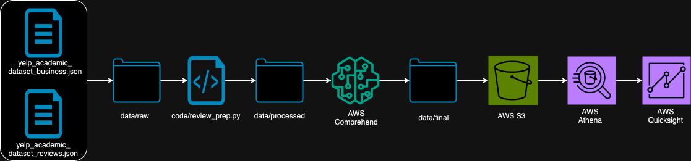

# Análisis de Reseñas de Yelp con Amazon Comprehend

## Colaboradores
- Erwin Minor - 214601
- Ximena Paz - 214570
- Mariano Villafuerte - 156057

## Tabla de Contenidos
- [Objetivo](#objetivo)
- [Descripción](#descripción)
- [Datos](#datos)
- [Herramientas utilizadas](#herramientas-utilizadas)
- [Arquitectura](#arquitectura)
- [Estructura del repositorio](#estructura-del-repositorio)
- [Instalación del ambiente](#instalación-del-ambiente)
- [Instrucciones de uso](#instrucciones-de-uso)
- [Agradecimientos](#agredecimientos)

## Objetivo
El objetivo de este proyecto es realizar un análisis de sentimiento de reseñas de Yelp con Amazon Comprehend. Una vez realizado el análisis, se hace una visualización de los resultados obtenidos mediante un dashboard en Amazon QuickSight.
Además, este proyecto se desarrolló con la metodología de "Working Backwards" de Amazon. El material producido en este proyecto se puede encontrar en el siguiente [link](https://drive.google.com/drive/folders/1s-R6YngJy_ZsVvINcbwwzZjydzwpaLr3?usp=sharing). 

## Descripción
Se busca dar visibilidad a restauranteros de los atributos positivos y negativos percibidos por los clientes. Esto puede ayudar a comprender a los tomadores de decisiones las fortalezas y puntos a mejorar del negocio. Este proyecto se puede adaptar para usar las reseñas propias de los restaurantes, por lo que no está limitado a Yelp.

## Datos 
Los datos utilizados en este proyecto son reseñas de Yelp. Estos datos se pueden encontrar en el siguiente [link](https://www.yelp.com/dataset).

## Herramientas utilizadas
Amazon Web Services (AWS):
- Amazon Comprehend
- Amazon QuickSight
- Amazon S3
- Python

## Arquitectura


## Estructura del repositorio
```
├── README.md
├── code
│   ├── notebooks
│   │   ├── 0_first_try.ipynb
│   │   ├── 1_etl.py
│   │   ├── 2_sentiment.py
│   │   ├── 3_keyWords.py
│   │   ├── 4_awscomprehend.ipynb
│   │   └── 4_comprehend.py
│   ├── review_prep.py
│   └── utils.py
├── data
│   ├── final
│   │   ├── README.md
│   │   ├── yelp_ihop_reviews.csv
│   │   └── yelp_ihop_reviews_sentiment_key.csv
│   ├── processed
│   │   ├── README.md
│   │   ├── yelp_ihop.csv
│   │   └── yelp_ihop_sentiment.csv
│   └── raw
│       ├── README.md
│       ├── yelp_academic_dataset_business.json
│       └── yelp_academic_dataset_review.json
├── environments.yml
├── packages.txt
└── requirements.txt
```
# Instalación del ambiente 
Para instalar el ambiente de trabajo, se debe correr el siguiente comando en la terminal:
```bash
conda env create -f environments.yml
```
O bien, usando el archivo de requerimientos:
```bash
pip install -r requirements.txt
```
La lista de librerías necesarias para correr el código se encuentra en el archivo `packages.txt`.

## Instrucciones de uso
Para correr el código, se debe seguir los siguientes pasos:
1. Descargar los datos de Yelp en el siguiente [link](https://www.yelp.com/dataset).
2. Guardar los archivos `yelp_academic_dataset_business.json` y `yelp_academic_dataset_review.json` en la carpeta `data/raw`.
3. Crear las carpetas de processed y final en la carpeta data.
4. Correr el script review_prep.py con el siguiente comando modificando los paths correspondientes:
```bash
python review_prep.py --review_file <path_to_review_file> --business_file <path_to_business_file> --output_file <output_file_path>
```
5. Cargar los datos a Amazon S3
    - Se pueden subir a mano los datos o con el siguiente comando
    ```bash
    aws s3 cp <path_to_file> s3://<bucket_name>/<file_name>
    ```
6. Se crea la base de datos en Athena con el siguiente script:
```sql
CREATE DATABASE yelp_reviews;
```
7. En Athena, correr el siguiente script para crear la tabla:
```sql
CREATE EXTERNAL TABLE IF NOT EXISTS yelp_reviews.ihop_reviews (
    review_id STRING,
    user_id STRING,
    business_id STRING,
    stars_x INT,
    useful INT,
    funny INT,
    cool INT,
    text STRING,
    date DATE,
    name STRING,
    address STRING,
    city STRING,
    state STRING,
    postal_code STRING,
    latitude DOUBLE,
    longitude DOUBLE,
    stars_y DOUBLE,
    review_count INT,
    is_open INT,
    attributes STRING,
    categories STRING,
    hours STRING,
    sentiment_value STRING,
    nouns STRING,
    adjectives STRING,
    keywords STRING,
    Sentiment STRING,
    SentimentScore DOUBLE,
    KeyPhrases STRING
)
ROW FORMAT SERDE 'org.apache.hadoop.hive.serde2.lazy.LazySimpleSerDe'
WITH SERDEPROPERTIES (
    'field.delim' = ',',
    'serialization.format' = ','
)
STORED AS INPUTFORMAT 'org.apache.hadoop.mapred.TextInputFormat' 
OUTPUTFORMAT 'org.apache.hadoop.hive.ql.io.HiveIgnoreKeyTextOutputFormat'
LOCATION 's3://PATH_TO_DATA/'
TBLPROPERTIES (
    'classification' = 'csv',
    'skip.header.line.count' = '1'
);
```
8. Se conecta Amazon QuickSight a la base de datos de Athena.

Para futuras actualizaciones, solo es necesario correr el script `review_prep.py` y cargar los datos a Amazon S3. Luego, se puede actualizar la tabla en Athena con el siguiente script:
```sql
MSCK REPAIR TABLE yelp_reviews.ihop_reviews;
```
Finalmente, se pueden actualizar los datos en Amazon QuickSight.


# Agredecimientos
Queremos agradecer a Dante Ruiz. Sin él, no tendríamos que hacer este proyecto. Dante.. gracias por tanto y perdón por tan poco.


